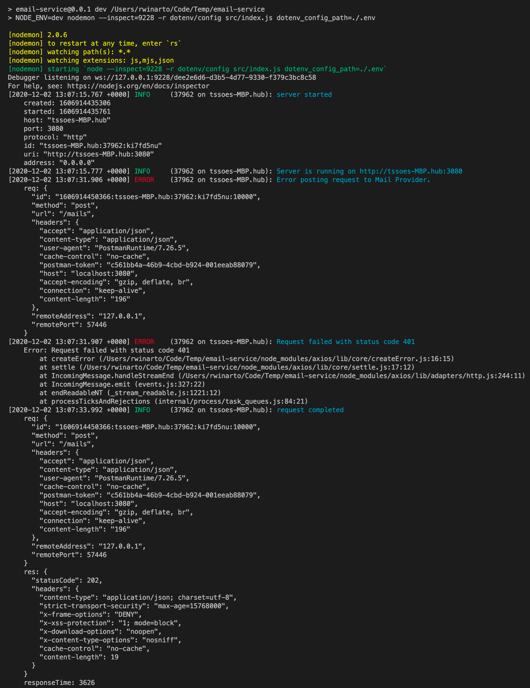
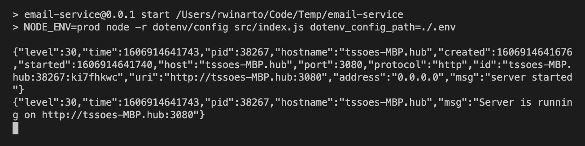
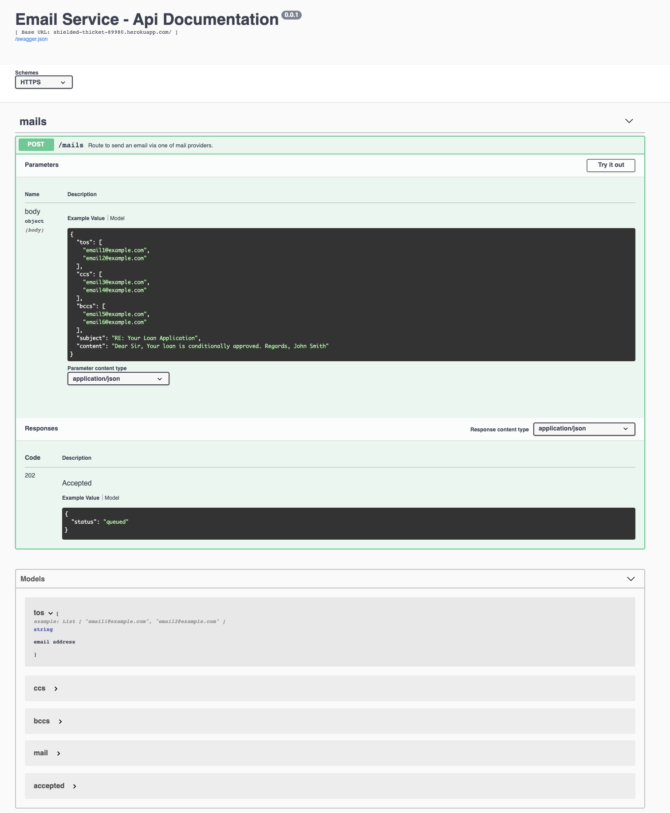

# Email Service

## Table of Contents

1. [About](#about)
1. [Service Features and Limitation](#service-features-and-limitations)
1. [Heroku App](#heroku-app)
1. [Install and Run Locally](#install-and-run-locally)
1. [Deployment to Heroku](#deployment-to-heroku)
1. [Testing](#testing)
1. [Dependencies](#dependencies)
1. [Project Directory Structure](#project-directory-structure)
1. [NPM Scripts](#npm-scripts)
1. [TODOs](#todos)
1. [Security](#security)
1. [Logging](#logging)
1. [API Documentation](#api-documentation)

## About

This Email Service provides an abstraction layer to send email between two different email service providers (SendGrid and MailGun). When the current active provider goes down, this Email Service will quickly failover to the second provider.

### Problem

Create a service that accepts the necessary information and sends emails. The application should provide an abstraction between two different email service providers. If one of the services goes down, your service can quickly failover to a different provider without affecting your customers.

Email Providers:

- Mailgun
- SendGrid

Above services are free to try. You may choose alternative email providers that have API integration.
Your solution should cater for multiple email recipients, CCs and BCCs but there is no need to support
HTML email body types (plain text is OK)

The solution should be implemented as one or more RESTful API calls (see technology constraints
below).

- No authentication is required for the scope of this exercise
- No 3rd party client library should be used to integrate with Mailgun, Sendgrid or other providers. A simple HTTP client of choice can be used to handcraft HTTP requests to the email gateway services.

### Scope

Non-crucial features can be left unimplemented and listed in the TODO section of the readme file.

## Service Features and Limitations

- Support multiple email recipients, CCs, and/or BCCs.
- Support plain text only (HTML is not currently supported).
- No API authentication is implemented (API is unsecured).
- Swagger documentation is available from `/documentation` route on non `prod` environment.

## Heroku App

- Endpoint: https://shielded-thicket-89980.herokuapp.com/mails
- Documentation: https://shielded-thicket-89980.herokuapp.com/documentation
- Environment level: `staging`
- The API can be tested directly via Swagger (Note: make sure your JSON payload is parsable - e.g. no dangling comma, no non closing double quotes, etc - if not Swagger will not even send the request - based on my testing)
- or use the following sample curl that can be imported into Postman
  ```
  curl -X POST "https://shielded-thicket-89980.herokuapp.com/mails" -H  "accept: application/json" -H  "Content-Type: application/json" -d "{ \"tos\": [ \"email1@example.com\" ], \"subject\": \"RE: Your Loan Application\", \"content\": \"Dear Sir, Your loan is conditionally approved. Regards, John Smith\"}"
  ```
- **Note:**
  - On application start `SendGrid` will be set as the primary/default.
  - With `SendGrid`, when sending emails to `gmail` or `yahoo`, emails were successfully delivered although sometimes they can be in Junk Mail folder, however, `hotmail` rejected the email altogether (marked as Blocked).
  - To test `MailGun` on this Heroku app, please let me know - I will need to make `SendGrid` API_KEY invalid.
  - `MailGun` also requires me to add recipients email addresses to Authorised recipients - so please let me know which email addresses to be whitelisted - if this is required.

## Install and Run Locally

- Clone repository (assuming Git is already installed on the machine).
- Run `npm install` (assuming Node and NPM are already installed on the machine).
- Create `.env` file on the project root with the following variables
  ```
  PORT=3080
  SENDGRID_API_BASE_URL=https://api.sendgrid.com/
  SENDGRID_API_KEY=<your-sendgrid-api-key>
  MAILGUN_API_BASE_URL=https://api.mailgun.net/v3/sandbox4df00f20e1aa4995b2b54395c62ee0df.mailgun.org/
  MAILGUN_API_KEY=<your-mailgun-api-key>
  ```
- To run application for development - run `npm run dev`
- Local endpoint: http://localhost:3080/mails
- Swagger: http://localhost:3080/documentation
- Note:
  - To test the failover to `MailGun`, make `SendGrid` API_KEY incorrect.
  - `npm run dev` will run as `dev` environment
    - application will auto-restart when code changes are saved
    - inspector is available - vs code debugger can be used
  - `npm start` will run as `prod` environment
    - payload validation will not contain the detail validation error, only showing 400 Bad Request
    - log will not be printed with easy to read format to allow easy parsing (in JSON)

## Deployment to Heroku

### Create and Configure Heroku app

- Install Git
- Clone repository
- Install `heroku CLI` - https://devcenter.heroku.com/articles/heroku-cli#download-and-install
- Run `heroku login -i` - enter your username and password
- Run `heroku create`
- Set environment variables by running the following `heroku CLI` commands
  ```
  heroku config:set NODE_ENV=staging
  heroku config:set SENDGRID_API_BASE_URL=https://api.sendgrid.com/
  heroku config:set SENDGRID_API_KEY=<your-sendgrid-api-key>
  heroku config:set MAILGUN_API_BASE_URL=https://api.mailgun.net/v3/sandbox4df00f20e1aa4995b2b54395c62ee0df.mailgun.org/
  heroku config:set MAILGUN_API_KEY=<your-mailgun-api-key>
  ```
- To check `heroku` environment variables run `heroku config`
- `PORT` environment variable does not need to be set on Heroku config because their documentation says "The port to bind to is assigned by Heroku as the `PORT` environment variable"

### Deploying to Heroku

```
npm run deploy:heroku
```

## Testing

- The project currently has two types of tests - unit tests and integration tests. The test strategy is following the test pyramid where we have many lower level test which provide very granular test (e.g. unit tests) and less high level tests such as integration, regression, UI tests).
- The next level testing would be end-to-end tests using tools such as Cypress (this test is not yet included in this project).
- Current test coverage is **100%** of Statements and Branches over **8 Test Suites and 57 Test Cases**
  

## Dependencies

### Production

| Name         | Description/Usage                                                                                                                                                                                                          |
| ------------ | -------------------------------------------------------------------------------------------------------------------------------------------------------------------------------------------------------------------------- |
| @hapi/boom   | HTTP-friendly error object package which is part of hapiJs ecosystem                                                                                                                                                       |
| @hapi/glue   | Server composer for hapiJs project - provides configuration based composition of hapiJs server object                                                                                                                      |
| @hapi/hapi   | Simple, secure framework providing powerful, scalable application with minimal overhead and out-of the box functionalities                                                                                                 |
| @hapi/inert  | Static file/directory plugin for hapiJs - this is required by hapi-swagger plugin                                                                                                                                          |
| @hapi/vision | Template rendering support for hapiJs - this is also required by hapi-swagger                                                                                                                                              |
| axios        | Promise based HTTP client                                                                                                                                                                                                  |
| confidence   | Configuration document format to extend JSON-based configuration which is used in conjunction with @hapi/glue for the server configuration to provide support for configuring different options for different environments |
| form-data    | A library to create readable "multipart/form-data" stream which is used in conjunction with axios to send request to MailGun API                                                                                           |
| hapi-pino    | HapiJs plugin for Pino logger. Logging in JSON for easy post-processing                                                                                                                                                    |
| hapi-swagger | OpenAPI (or Swagger) plugin for HapiJs providing self documentation of the API interface                                                                                                                                   |
| joi          | JSON schema validation library that is part of hapiJs ecosystem                                                                                                                                                            |
| toys         | Toys is a collection of utilities made to reduce common boilerplate in hapiJs project                                                                                                                                      |

### Development

| Name                      | Description/Usage                                                                                                      |
| ------------------------- | ---------------------------------------------------------------------------------------------------------------------- |
| dotenv                    | Package to load environment variables from a `.env` file into `process.env`                                            |
| eslint                    | Tool to identify and report on writting pattern in Javascript codes.                                                   |
| eslint-config-airbnb-base | Airbnb base eslint configuration                                                                                       |
| eslint-config-prettier    | Prettier eslint configuration                                                                                          |
| eslint-plugin-import      | Eslint plugin to support linting of ES6+ import/export syntax - required dependency for airbnb base                    |
| eslint-plugin-prettier    | Eslint plugin for prettier                                                                                             |
| jest                      | Javascript testing framework used for this project                                                                     |
| nodemon                   | Utility that will monitor for any changes in your source and automatically restart your server - for local development |
| prettier                  | The actually prettier tool                                                                                             |

## Project Directory Structure

The project structure is impired by [The 12-factor App design](https://12factor.net/) as much as possible (obviously not everything is implemented due to time and environment constraints)

```
|-- .vscode
    |-- launch.json             # vscode debug configuration for this project
    |-- settings.json           # vscode workspace settings - currently only forcing to format onSave but will require some plugins to be installed (e.g. Prettier, ESLint)
|-- assets                      # folder to store static files such as images
|-- src                         # root source code directory
    |-- api                     # hapiJs plugin containing the api routes and handler
        |-- handlers            # handlers grouped by route/path
        |-- routes              # hapiJs route configuration including request and response validations as well as swagger metadata
    |-- lib                     # directory containing custom classes, modules or functions
        |-- mails               # grouping of mail provider classes
        |-- utils               # collections of shared/utility functions
    |-- constants.js            # any constant values used in multiple places include list of custom ERROR messages
    |-- manifest.js             # hapiJs server configuration (including plugins being used)
|-- test                        # the root directory for all jest tests
    |-- integration             # directory containing smoke tests to test the hapiJs server route (end-to-end except external API calls are mocked) - the ideas is to make sure the codes are working on hapiJs framework - not just in unit individually
    |-- unit                    # directory containing individual file unit tests
    |-- .env.test               # is mock environment variables to be use in testing - no real values - so it is safe for this file to be committed in git
|-- .env                        # the actual environment variables needed to run the application (not committed to git but sample can be found in the "Install and Run Locally" section above.)
|-- .eslint.rc                  # our eslint config file airbnb-base with prettier is used
|-- .gitignore                  # list of file/directory pattern to be ignored by git
|-- .prettierrc.js              # prettier configuration
|-- jest.config.js              # jest config file including which files to be included in coverage and to execute setupFiles on each test execution
|-- package.json                # the pacakage configuration
|-- Procfile                    # specifies the commands that are executed by Heroku app on startup
```

## NPM Scripts

| Script        | Description                                                                                             |
| ------------- | ------------------------------------------------------------------------------------------------------- |
| test          | Runs tests against local code                                                                           |
| start         | Starts local environment in prod version                                                                |
| dev           | Starts local environment for development (server auto restart on code change and debugger is available) |
| deploy:heroku | Deploy last commit to master to heroku                                                                  |
| eslint        | Runs eslint and gets a list of linting errors                                                           |
| eslint:fix    | Runs eslint and fix lint error with best-effort                                                         |

## TODOs

- Support HTML email
- Sanitise payload to improve security
- Add Authentication
- Rather than just return with error if we cannot send the email from both providers due to both being unavailable - we can put it in some sort of queue to retry again later
- Handle timeouts - we use axios default timeout which is set to 0 - which means we can wait as long as the provider server allowed. Consideration: if we want to terminate the request, we need to make sure we can cancel it, otherwise, the logic will carry on to the next provider and email may end up being sent twice.
- Add `husky` pre-commit hook that run `lint-staged` and `unit tests` - to prevent developer to commit badly formatted codes or codes with failing unit tests.
- Add End-to-end testing using tools such as Cypress.
- Setup deployment pipeline (build - test - deploy - promote to higher environment) which executes different deployment scripts (such as bash script) stored in this repo.
- As part of the deployment pipeline we can also add a step to scan our code for security using tools such as Checkmarx or Fortify on Demand.

## Security

HapiJs has built in security features that are enabled on this project https://hapi.dev/api/?v=20.0.3#-routeoptionssecurity - following are some that they cover:

- `hsts` - controls the 'Strict-Transport-Security' header - default: `max-age=15768000`
- `xframe` - controls the 'X-Frame-Options' header - default: `deny`
- `xss` - controls the 'X-XSS-PROTECTION' header - default: `'1; mode=block'`
- `noSniff` - control the 'X-Content-Type-Options' header - default: `'nosniff'`
- and some more

## Logging

- On **dev** environment the log output will look like below (formatted, easy to read, and contain correlation id e.g. request.id for easy tracing).
  

- On **prod** environment the log output will not be easily read but is easily parsed by log analysis tool like Splunk, NewRelic, Cloudwatch, etc.
  

## API Documentation

Swagger is available from `/document` route e.g. https://shielded-thicket-89980.herokuapp.com/documentation as you can see below. It contains sample request payload and models structure.

