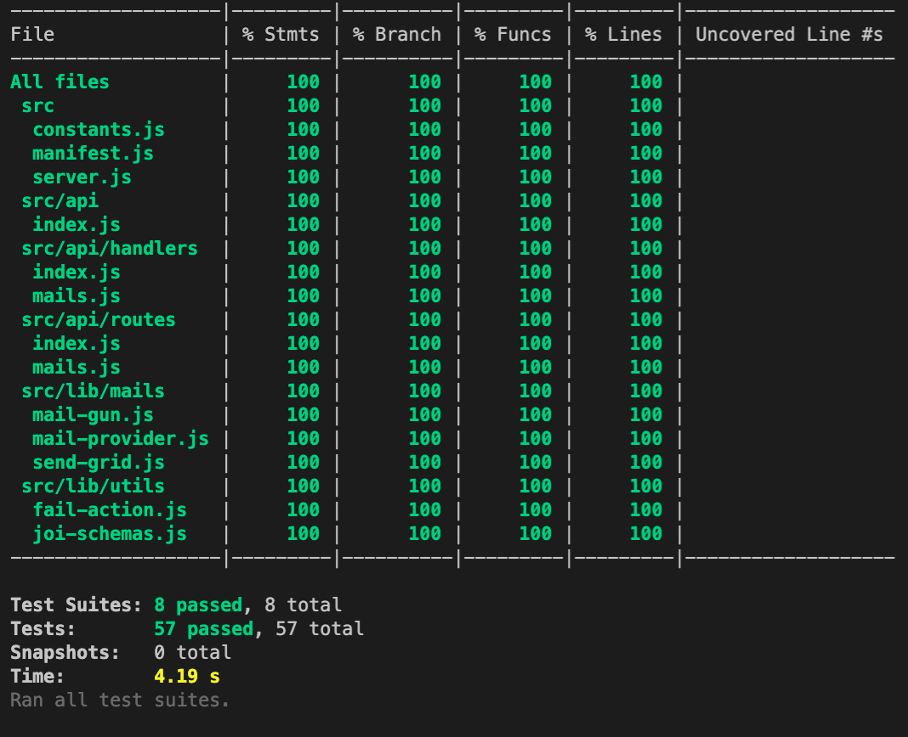

# Email Service

## About

This Email Service provides an abstraction layer to send email between two different email service providers (SendGrid and MailGun). When the current active provider goes down, this Email Service will quickly failover to the second provider.

## Service Features and Limitations

- Support multiple email recipients, CCs, and/or BCCs.
- Support plain text only (HTML is not currently supported).
- No API authentication is implemented (API is unsecured).
- Swagger documentation is available from `/documentation` route on non `prod` environment.

## Heroku App

- Endpoint: https://shielded-thicket-89980.herokuapp.com/mails
- Documentation: https://shielded-thicket-89980.herokuapp.com/documentation
- Environment level: `staging`
- The API can be tested directly via Swagger.
- or use the following sample curl that can be imported into Postman
  ```
  curl -X POST "https://shielded-thicket-89980.herokuapp.com/mails" -H  "accept: application/json" -H  "Content-Type: application/json" -d "{ \"tos\": [ \"email1@example.com\" ], \"subject\": \"RE: Your Loan Application\", \"content\": \"Dear Sir, Your loan is conditionally approved. Regards, John Smith\"}"
  ```
- **Note:**
  - On application start `SendGrid` will be set as the primary/default.
  - With `SendGrid`, when sending emails to `gmail` or `yahoo`, emails were successfully delivered although sometimes they can be in Junk Mail folder, however, `hotmail` rejected the email altogether (marked as Blocked).
  - To test `MailGun` on this Heroku app, please let me know - I will need to make `SendGrid` API_KEY invalid.
  - `MailGun` also requires me to add recipients email addresses to Authorised recipients - so please let me know which email addresses to be whitelisted - if this is required.

## Install and Run Locally

- Clone repository (assuming Git is already installed on the machine).
- Run `npm install` (assuming Node and NPM are already installed on the machine).
- Create `.env` file on the project root with the following variables
  ```
  PORT=3080
  SENDGRID_API_BASE_URL=https://api.sendgrid.com/
  SENDGRID_API_KEY=<your-sendgrid-api-key>
  MAILGUN_API_BASE_URL=https://api.mailgun.net/v3/sandbox4df00f20e1aa4995b2b54395c62ee0df.mailgun.org/
  MAILGUN_API_KEY=<your-mailgun-api-key>
  ```
- To run application for development - run `npm run dev`
- Local endpoint: http://localhost:3080/mails
- Swagger: http://localhost:3080/documentation
- Note:
  - To test the failover to `MailGun`, make `SendGrid` API_KEY incorrect.
  - `npm run dev` will run as `dev` environment
    - application will auto-restart when code changes are saved
    - inspector is available - vs code debugger can be used
  - `npm start` will run as `prod` environment
    - payload validation will not contain the detail validation error, only showing 400 Bad Request
    - log will not be printed with easy to read format to allow easy parsing (in JSON)

## Deployment to Heroku

### Create and Configure Heroku app

- Install Git
- Clone repository
- Install `heroku CLI` - https://devcenter.heroku.com/articles/heroku-cli#download-and-install
- Run `heroku login -i` - enter your username and password
- Run `heroku create`
- Set environment variables by running the following `heroku CLI` commands
  ```
  heroku config:set NODE_ENV=staging
  heroku config:set SENDGRID_API_BASE_URL=https://api.sendgrid.com/
  heroku config:set SENDGRID_API_KEY=<your-sendgrid-api-key>
  heroku config:set MAILGUN_API_BASE_URL=https://api.mailgun.net/v3/sandbox4df00f20e1aa4995b2b54395c62ee0df.mailgun.org/
  heroku config:set MAILGUN_API_KEY=<your-mailgun-api-key>
  ```
- To check `heroku` environment variables run `heroku config`

### Deploying to Heroku

```
npm run deploy:heroku
```

## Test Coverage

Current test coverage is **100%** of Statements and Branches over **8 Test Suites 57 Tests**


## Dependencies

## Project Directory Structure

```
|-- .vscode
    |-- launch.json             # vscode debug configuration for this project
    |-- settings.json           # vscode workspace settings - currently only forcing to format onSave but will require some plugins to be installed (e.g. Prettier, ESLint)
|-- assets                      # folder to store static files such as images
|-- src                         # root source code directory
    |-- api                     # hapiJs plugin containing the api routes and handler
        |-- handlers            # handlers grouped by route/path
        |-- routes              # hapiJs route configuration including request and response validations as well as swagger metadata
    |-- lib                     # directory containing custom classes, modules or functions
        |-- mails               # grouping of mail provider classes
        |-- utils               # collections of shared/utility functions
    |-- constants.js            # any constant values used in multiple places include list of custom ERROR messages
    |-- manifest.js             # hapiJs server configuration (including plugins being used)
|-- test                        # the root directory for all jest tests
    |-- integration             # directory containing smoke tests to test the hapiJs server route (end-to-end except external API calls are mocked) - the ideas is to make sure the codes are working on hapiJs framework - not just in unit individually
    |-- unit                    # directory containing individual file unit tests
    |-- .env.test               # is mock environment variables to be use in testing - no real values - so it is safe for this file to be committed in git
|-- .env                        # the actual environment variables needed to run the application (not committed to git but sample can be found in the "Install and Run Locally" section above.)
|-- .eslint.rc                  # our eslint config file airbnb-base with prettier is used
|-- .gitignore                  # list of file/directory pattern to be ignored by git
|-- .prettierrc.js              # prettier configuration
|-- jest.config.js              # jest config file including which files to be included in coverage and to execute setupFiles on each test execution
|-- package.json                # the pacakage configuration
|-- Procfile                    # specifies the commands that are executed by Heroku app on startup
```

## NPM Scripts

| **Script**    | **Description**                                                                                         |
| ------------- | ------------------------------------------------------------------------------------------------------- |
| test          | Runs tests against local code                                                                           |
| start         | Starts local environment in prod version                                                                |
| dev           | Starts local environment for development (server auto restart on code change and debugger is available) |
| deploy:heroku | Deploy last commit to master to heroku                                                                  |
| eslint        | Runs eslint and gets a list of linting errors                                                           |
| eslint:fix    | Runs eslint and fix lint error with best-effort                                                         |

## Feature TODOs

- Support HTML email
- Sanitise payload to improve security
- Add Authentication
- Rather than just return with error if we cannot send the email from both providers due to both being unavailable - we can put it in some sort of queue to retry again later
- Handle timeouts - we use axios default timeout which is set to 0 - which means we can wait as long as the provider server allowed. Consideration: if we want to terminate the request, we need to make sure we can cancel it, otherwise, the logic will carry on to the next provider and email may end up being sent twice.

## Security

HapiJs has built in security features that are enabled on this project https://hapi.dev/api/?v=20.0.3#-routeoptionssecurity - following are some that they cover:

- `hsts` - controls the 'Strict-Transport-Security' header - default: `max-age=15768000`
- `xframe` - controls the 'X-Frame-Options' header - default: `deny`
- `xss` - controls the 'X-XSS-PROTECTION' header - default: `'1; mode=block'`
- `noSniff` - control the 'X-Content-Type-Options' header - default: `'nosniff'`
- and some more
